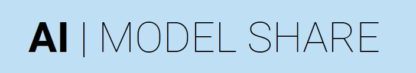

- The mission of the AI Model Share Platform is to provide a trusted repository for machine learning model prediction APIs (python library + integrated website at modelshare.org.  The beta version of the platform now enables faculty, students, and the wider data science community to ***launch machine learning models into scalable production ready prediction REST APIs using a single Python function.*** 

- ***Details about each model, how to use the model's API, and the model's author(s) are deployed simultaneously into a searchable website at modelshare.org.*** 

- ***Data scientists (faculty, students and otherwise) receive individual model detail pages listing information about all deployed models. Each of these pages includes a fully functional prediction dashboard that allows end-users to input text, tabular, or image data and receive live predictions.*** Moreover, documentation for prediction API usage via Curl, Python, and R code are also available.

- In a matter of seconds, data scientists can launch a model into this infrastructure and end-users the world over will be able to engage their machine learning models. A developer version of the platform is currently being used by Columbia University students, faculty, and staff to test and improve platform functionality.

# Use aimodelshare Python library to deploy your model
* [Tutorials for deploying models](https://github.com/aimodelshare/tutorials).

# Find model detail pages and generate predictions
* [View deployed models and generate predictions at modelshare.org](http://mlsite5aimodelshare-dev.s3-website.us-east-2.amazonaws.com/)
